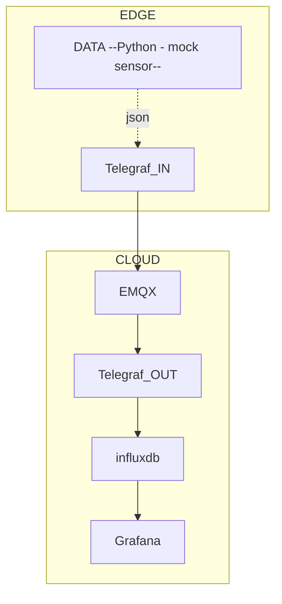

<!--
```mermaid
---
title: SELF
---
%%{init: {"flowchart": {"htmlLabels": false}} }%%
```
-->

```mermaid
flowchart TB;

DATA[DATA --Python - mock sensor--]
Telegraf_IN

EMQX
Telegraf_OUT
influxdb
Grafana

    Telegraf_IN-->EMQX

    subgraph EDGE
    DATA -. json .->
        Telegraf_IN
    end

    subgraph CLOUD
    EMQX -->
        Telegraf_OUT -->
            influxdb -->
                Grafana
    end
    
```